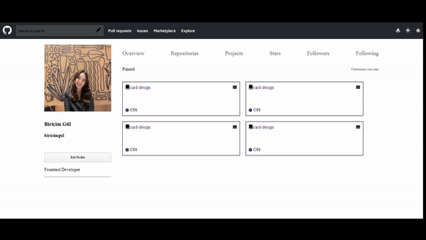

<h1> GitHub Project </h1>

This project represents a basic-level website designed using HTML,CSS and SCSS.

<h2> The technologies used in the project </h2>

It was coded using HTML,CSS and SCSS technologies.

<h2> Screenshot </h2>

